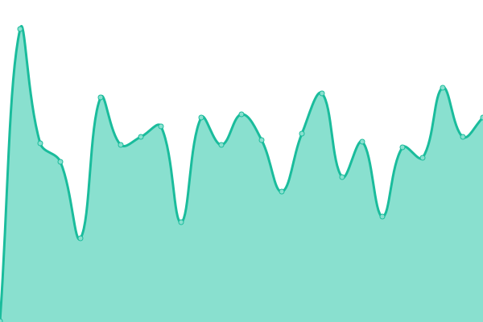
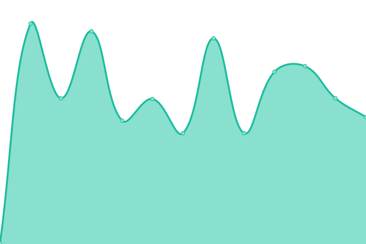
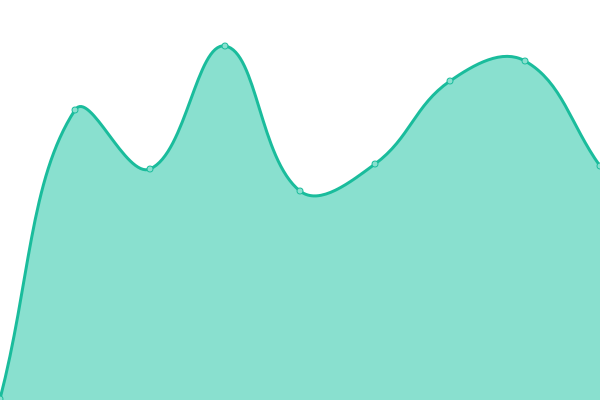
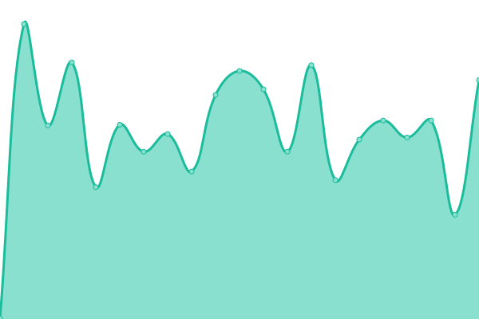
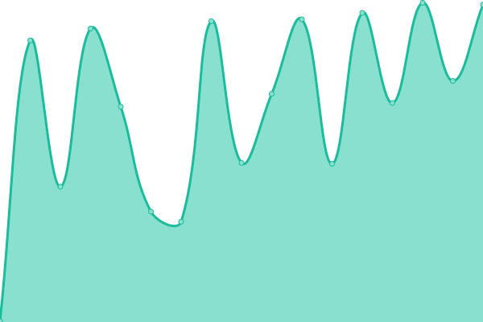
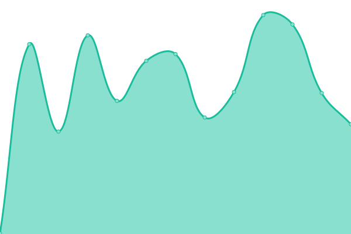
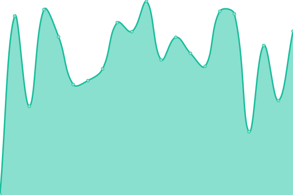

# [📈 Live Status](https://demo.upptime.js.org): <!--live status--> **🟩 All systems operational**

This repository contains the open-source uptime monitor and status page for [Katapult Commerce](http://katapultcommerce.com), powered by [Upptime](https://github.com/upptime/upptime).

With [Upptime](https://upptime.js.org), you can get your own unlimited and free uptime monitor and status page, powered entirely by a GitHub repository. We use [Issues](https://github.com/MiAguila/uptime/issues) as incident reports, [Actions](https://github.com/MiAguila/uptime/actions) as uptime monitors, and [Pages](https://demo.upptime.js.org) for the status page.

<!--start: status pages-->
<!-- This summary is generated by Upptime (https://github.com/upptime/upptime) -->
<!-- Do not edit this manually, your changes will be overwritten -->
<!-- prettier-ignore -->
| URL | Status | History | Response Time | Uptime |
| --- | ------ | ------- | ------------- | ------ |
|  [Grinest Landing Page](https://grinest.com/) | 🟩 Up | [grinest-landing-page.yml](https://github.com/Grinest/status/commits/HEAD/history/grinest-landing-page.yml) | 

 230ms
     
 | 

<a href="https://status.prd.grinest.com/history/grinest-landing-page">100.00%</a>
    

|  [Control Tower Web](https://control-tower.grinest.com/) | 🟩 Up | [control-tower-web.yml](https://github.com/Grinest/status/commits/HEAD/history/control-tower-web.yml) | 

 228ms
     
 | 

<a href="https://status.prd.grinest.com/history/control-tower-web">100.00%</a>
    

|  [Core API](https://core.api.prd.grinest.com/v1/health/) | 🟩 Up | [core-api.yml](https://github.com/Grinest/status/commits/HEAD/history/core-api.yml) | 

 276ms
     
 | 

<a href="https://status.prd.grinest.com/history/core-api">100.00%</a>
    

|  [Tasks Server API (Celery)](https://tasks-server.api.prd.grinest.com/v1/health/) | 🟩 Up | [tasks-server-api-celery.yml](https://github.com/Grinest/status/commits/HEAD/history/tasks-server-api-celery.yml) | 

 261ms
     
 | 

<a href="https://status.prd.grinest.com/history/tasks-server-api-celery">100.00%</a>
    

|  [Webhooks API](https://webhooks.api.prd.grinest.com/v1/health/) | 🟩 Up | [webhooks-api.yml](https://github.com/Grinest/status/commits/HEAD/history/webhooks-api.yml) | 

 245ms
     
 | 

<a href="https://status.prd.grinest.com/history/webhooks-api">100.00%</a>
    

|  [Metabase](https://metabase.prd.grinest.com/) | 🟩 Up | [metabase.yml](https://github.com/Grinest/status/commits/HEAD/history/metabase.yml) | 

 341ms
     
 | 

<a href="https://status.prd.grinest.com/history/metabase">100.00%</a>
    

|  [Grafana](https://grafana.prd.grinest.com/) | 🟩 Up | [grafana.yml](https://github.com/Grinest/status/commits/HEAD/history/grafana.yml) | 

 337ms
     
 | 

<a href="https://status.prd.grinest.com/history/grafana">100.00%</a>
    

<!--end: status pages-->

[**Visit our status website →**](https://demo.upptime.js.org)

## 📄 License

- Powered by: [Upptime](https://github.com/upptime/upptime)
- Code: [MIT](./LICENSE) © [Katapult Commerce](http://katapultcommerce.com)
- Data in the `./history` directory: [Open Database License](https://opendatacommons.org/licenses/odbl/1-0/)
